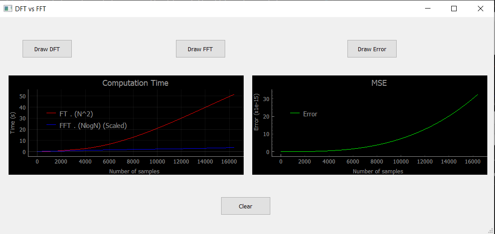

#  Fast Fourier Transform:

There is always a need to speed up the FT calculations. FFT is one of the famous established techniques in this direction. 
So we did implementations on the FT and the FFT and we plot the output to get:
 

The main obvious result is that the curve of the FFT was NlogN while the curve of the FT was N^2 which take longer time to be iimplemented.

And finally when we plotted the error we found that ideally the two should be identical but there might be some rounding errors.

 
